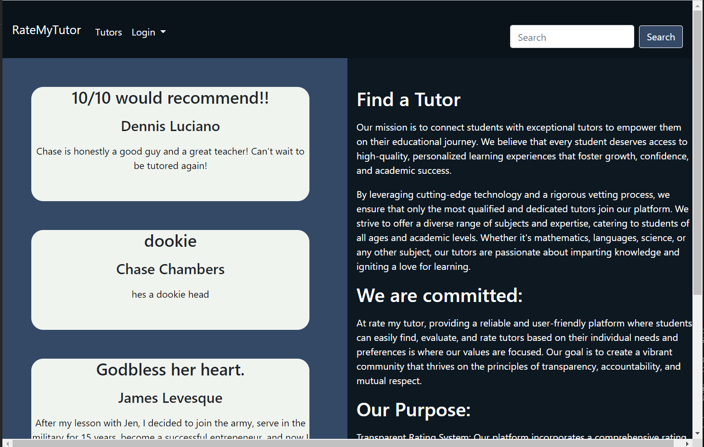
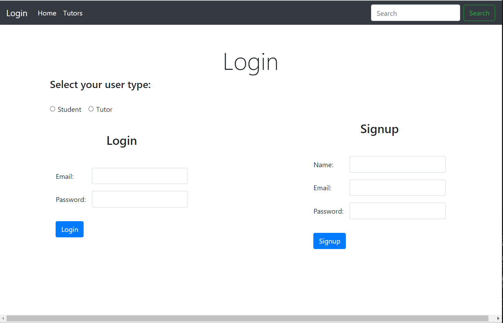

# README.MD Rate My Tutor

## Authors

Devin Nunez
Forrest King
Michael Prevost

Email: 
devv-nunn@gmail.com
king.forrest828@gmail.com
prevostm17@yahoo.com

git: 
https://github.com/devv-nunn
https://github.com/isen28
https://github.com/m00krat

## Description

In this project we will create a an application that will help students find the perfect tutor for there needs by displaying all available tutors and their reviews.

This website relys on our users to leave tutor reviews. These tutor reviews will be listed for other users to use as a reference.

We will be using express to handle our routes and sequalize to proform CRUD operations on our database.

We also use Mysql12 as our database. This database has 3 tables. Student, Tutor, and Review.

In this project we learned how to tie in all aspects of web development to make our first full stack project.
## Table of Contents (Optional)

N/a

## Installation

- vs.code and node.js must be installed to use this applicationn

- Clone the following repository after installing vs.code and node.js 

- in terminal run npm i as it will download necessary dependencies such as express, mysql12.

- for mysql download docker and start a mysql container. Documentation on this process online.

## Usage

To use this application write "node index.js" this will start the web application on the local host.

After starting up the application, users are able to navigate around our whole website without logging in. If you want to leave a review for a specific tutor you will need to log in for that.

Users are able to log in as a student or as a tutor.

After logging in as a student you are then able to leave reviews for individual tutors.

Users can also navigate to our tutors page which will display all tutors. Users could then click on a tutor name which will navigate the user to the corrisponding tutors profile page which will display tutor information and all reviews that have been left for that tutor. This can help you dicide whether or not that tutor is right for you by noting all of the reviews left by other students.

## Application screenshots

## Videos Demonstrating application:
N/A

## Deployment

Repo: https://github.com/DevinDevelopment/TutorFinder
Heroku: https://obscure-fortress-09453-d190392c47f1.herokuapp.com/

# Tech Stack

HTML
CSS
JavaScript
Node.js
Express.js
Sequalize
mysql
Validator

## Credits

N/a

## License

MIT License.